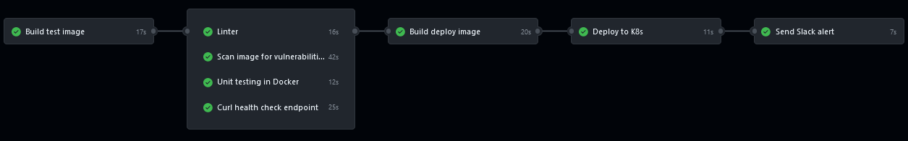

# Overview

In this project, the **CI/CD** pipeline is divided into four phases:

1. **Build and push a test image**

   This phase involves creating and pushing a test image to a container registry. The purpose is to encapsulate the new code version and prepare it for testing.

2. **Run different tests on this image**

   Once the test image is available, various tests are executed to validate that the new code version adheres to best practices and does not introduce any issues that might affect existing functionality.

3. **Build and push a new image for deployment**

   After successful testing, a new image is built, incorporating the changes. This image is then pushed to the container registry, ready for deployment.

4. **Deploy the newly created image on a Kubernetes cluster on Digital Ocean**

   In the final phase, the newly built image is deployed to a Kubernetes cluster hosted on Digital Ocean. 

# In-Depth Explonation of CI/CD Phases

- **First & Second Phases**


## Curl
```
curl -X POST \
  -d '[1, 2, 3, 4, 5]' \
  -H "Content-Type: application/json" \
  http://157.245.30.11:8080/sum
```