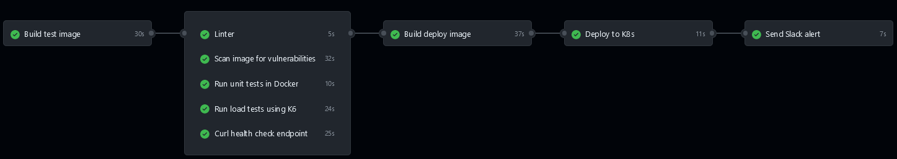

# Overview

This Go project provides easy-to-use endpoints for performing math operations like addition, subtraction, bitwise operations and more.

In this project, the **CI/CD** pipeline is divided into five phases:

1. **Build and push to GHCR a test image**

2. **Run different tests on this image to validate new changes**

3. **Build and push to Docker Hub a image for deployment**

4. **Deploy the newly created image on a Kubernetes cluster on Digital Ocean**

5. **Send notification in Slack chanel**


# In-Depth Explanation of CI/CD Phases

- **First & Second Phases**

   The **CI/CD** pipeline for this project is triggered by one of three events:

   - Push to the main branch

   - Pull request

   - Creation of a tag

   Pushes to the main branch and pull requests execute only the first and second phases. In contrast, when a tag is created, the entire pipeline is executed. Therefore, the first and second phases are crucial as they run every time the CI/CD pipeline is triggered.

   In the initial phase, a new image is generated in the format `ghcr.io/iypetrov/go-calc:<github-runner-id>`, and it's published to GHCR. This temporary image serves only for testing purposes and is intentionally excluded from being pushed to the main registry (**Docker Hub**) to avoid unnecessary clutter in the primary registry. 

   In the second phase, five types of tests are conducted:

   - **Linter Analysis:** 
   
      Runs the default and most popular Golang linter `golangci-lint`. It analyzes source code to flag programming errors, bugs, stylistic errors, and suspicious constructs.

      

   - **CVE Scan Verification:** 
   
      Conducts a Trivy scan to identify potential security issues within the project's dependencies. This test is non-blocking, meaning it won't prevent the workflow from proceeding regardless of the security findings. Its main purpose is to provide suggestions for improving security. Upon completion, the Trivy scan results are uploaded to the GitHub Security tab for further analysis.

      

   - **Execution of Unit Tests:** 
   
      All default unit and benchmark tests are executed.

  - **Execution of Load Tests:**

      Spin up a container and initiate a K6 load test. The test succeeds if over 95% of requests are completed in less than 200 milliseconds, and the failed requests stay below 1%.

   - **Health-Check Test Performance:** 
   
      A container is spun up and curled three times with a 5-second interval between attempts. During each trial, the `/health-check` endpoint is accessed, and the test is considered successful only if all three attempts are completed successfully.

- **Third Phase**

   The first and third phases share substantial similarities. The key distinction is that the third phase, along with subsequent phases (fourth and fifth), is exclusively executed when the action involves creating a tag. Additionally, in this phase, the image is published only to Docker Hub following the format `iypetrov/go-calc:<tag>`.

- **Fourth phase**

   The fourth phase involves deploying the freshly created image to our Kubernetes cluster. Our cluster, hosted on Digital Ocean, operates with a single node. Within this node, three instances of the `go-calc` service are running, complemented by a load balancer for public exposure.

   

- **Fifth phase**

   In the final phase, once everything is completed, a notification is sent to our Slack channel `#deployment`. The notification includes information on the success of the deployment and specifies the image that has been pushed to the production.

   

## Hints

- To test if the app is working on production:
   ```
   curl -X POST \
   -d '[1, 2, 3, 4, 5]' \
   -H "Content-Type: application/json" \
   http://157.245.30.11:8080/sum
   ```

- To see all pods:
   ```
   kubectl get pods -o wide
   ```

- To see pod's images:
   ```
   kubectl get pods -o wide | \
   awk '{print $1}' | \
   tail -n +2 | \
   while read -r pod; do
      echo "Pod:   $pod"
      kubectl describe pod "$pod" | grep Image: | awk '{print "Image: " $2}' && echo
   done
   ```